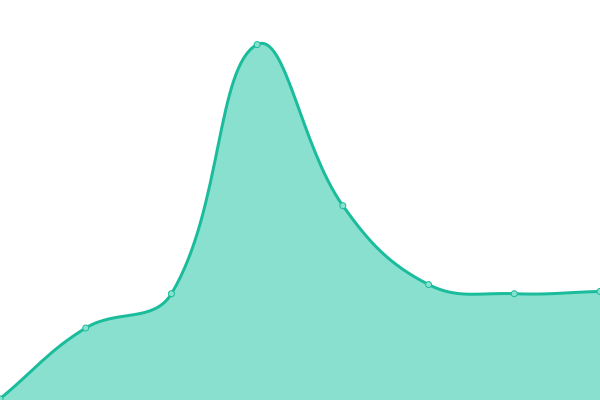

# [📈 Live Status](https://0xTwyne.github.io/upptime): <!--live status--> **🟧 Partial outage**

This repository contains the open-source uptime monitor and status page for [Twyne](https://twyne.xyz/), powered by [Upptime](https://github.com/upptime/upptime).

With [Upptime](https://upptime.js.org), you can get your own unlimited and free uptime monitor and status page, powered entirely by a GitHub repository. We use [Issues](https://github.com/0xTwyne/upptime/issues) as incident reports, [Actions](https://github.com/0xTwyne/upptime/actions) as uptime monitors, and [Pages](https://0xTwyne.github.io/upptime) for the status page.

<!--start: status pages-->
<!-- This summary is generated by Upptime (https://github.com/upptime/upptime) -->
<!-- Do not edit this manually, your changes will be overwritten -->
<!-- prettier-ignore -->
| URL | Status | History | Response Time | Uptime |
| --- | ------ | ------- | ------------- | ------ |
|  [Twyne Homepage](https://twyne.xyz/) | 🟥 Down | [twyne-homepage.yml](https://github.com/0xTwyne/upptime/commits/HEAD/history/twyne-homepage.yml) | 

 105ms
     
 | 

<a href="https://0xTwyne.github.io/upptime/history/twyne-homepage">0.00%</a>
    

|  [Twyne dApp](https://app.twyne.xyz/) | 🟥 Down | [twyne-d-app.yml](https://github.com/0xTwyne/upptime/commits/HEAD/history/twyne-d-app.yml) | 

 100ms
     
 | 

<a href="https://0xTwyne.github.io/upptime/history/twyne-d-app">0.00%</a>
    

|  [Twyne docs](https://twyne.gitbook.io/twyne) | 🟩 Up | [twyne-docs.yml](https://github.com/0xTwyne/upptime/commits/HEAD/history/twyne-docs.yml) | 

 431ms
     
 | 

<a href="https://0xTwyne.github.io/upptime/history/twyne-docs">100.00%</a>
    

|  [Twyne blog](https://mirror.xyz/0x35Faca6D5e25Bd1b498BBE312176cc010cB099F5) | 🟥 Down | [twyne-blog.yml](https://github.com/0xTwyne/upptime/commits/HEAD/history/twyne-blog.yml) | 

 84ms
     
 | 

<a href="https://0xTwyne.github.io/upptime/history/twyne-blog">0.00%</a>
    

<!--end: status pages-->

[**Visit our status website →**](https://0xTwyne.github.io/upptime)

## 📄 License

- Powered by: [Upptime](https://github.com/upptime/upptime)
- Code: [MIT](./LICENSE) © [Anand Chowdhary](https://anandchowdhary.com), supported by [Pabio](https://pabio.com)
- Data in the `./history` directory: [Open Database License](https://opendatacommons.org/licenses/odbl/1-0/)
